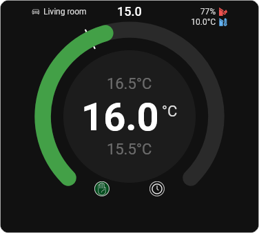
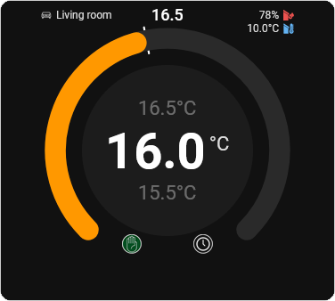
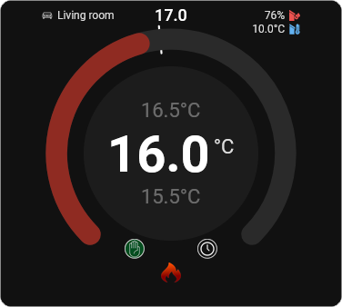
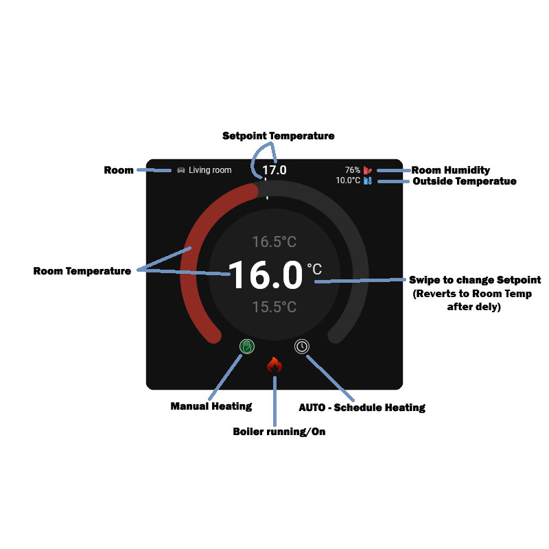

# Thermo Wheel Card

A custom Home Assistant thermostat card with a circular gauge, based very loosley on the BOSCH CT200 interface, swipe temperature control, manual/auto mode buttons, room icons, outside temperature, and indoor humidity.

## Screenshots








## Features

- Circular thermostat-style gauge
- Swipe or mouse-wheel setpoint adjustment
- Delayed setpoint commit
- Gauge colour changes by state:
  - red when heating
  - amber when below setpoint but not heating
  - green when at or above setpoint and not heating
- Flame icon when heating is active
- Manual and auto HVAC mode buttons
- Room name from the climate entity friendly name
- Room icon chosen automatically from the room name
- Top-right outside temperature and indoor humidity indicators
- Temperature and humidity icons coloured dynamically

## Current supported room icons

The room icon is chosen from the climate entity `friendly_name` value, case-insensitive.

Supported names:

- `Living Room` → `living_room.png`
- `Bed Room` or `Bedroom` → `bed_room.png`
- `Office` or `Study` → `office.png`
- `Dining Room` → `dining_room.png`
- `Kitchen`, `Utility`, or `Utility Room` → `kitchen.png`

## Project structure

```text
thermo-wheel-card/
├─ assets/
│  ├─ auto_off.png
│  ├─ auto_on.png
│  ├─ bed_room.png
│  ├─ boiler_flame.png
│  ├─ dining_room.png
│  ├─ humidity.png
│  ├─ kitchen.png
│  ├─ living_room.png
│  ├─ manual_off.png
│  ├─ manual_on.png
│  ├─ office.png
│  └─ outside_temp.png
├─ dist/
│  └─ thermo-wheel-card.js
├─ src/
│  └─ thermo-wheel-card.ts
├─ package.json
├─ tsconfig.json
├─ README.md
└─ LICENSE
```

## Requirements

- Home Assistant
- A climate entity, for example:
  - `climate.living_room`
- Optional sensors for:
  - outside temperature
  - indoor humidity

## Build

From the project folder:

```bash
npm install
npm run build
```

This creates:

```text
dist/thermo-wheel-card.js
```

## Install in Home Assistant

### 1. Copy the built JavaScript file

Copy:

```text
dist/thermo-wheel-card.js
```

to:

```text
/config/www/thermo_wheel_card/thermo-wheel-card.js
```

### 2. Copy the image assets

Copy all files from:

```text
assets/
```

to:

```text
/config/www/thermo_wheel_card/
```

### 3. Add the Lovelace resource

In Home Assistant, add this dashboard resource:

```yaml
url: /local/thermo_wheel_card/thermo-wheel-card.js
type: module
```

### 4. Add the card to your dashboard

Example:

```yaml
type: custom:thermo-wheel-card
entity: climate.living_room
min: 5
max: 30
step: 0.5
units: "\u00B0C"
commit_delay: 5000
top_right_temperature_entity: sensor.outdoor_temperature
top_right_humidity_entity: sensor.indoor_humidity
```

## Configuration options

| Option | Required | Description |
|---|---:|---|
| `entity` | Yes* | Climate or number entity |
| `input_entity` | Yes* | Alternative to `entity` |
| `current_entity` | No | Optional current temperature sensor when not using a climate entity |
| `min` | No | Minimum selectable temperature |
| `max` | No | Maximum selectable temperature |
| `step` | No | Temperature increment |
| `units` | No | Temperature units, default `\u00B0C` |
| `commit_delay` | No | Delay before sending selected setpoint, in ms |
| `top_right_temperature_entity` | No | Outside temperature sensor |
| `top_right_humidity_entity` | No | Indoor humidity sensor |

\* Use either `entity` or `input_entity`.

## Climate behaviour

For climate entities, the card uses:

- `attributes.temperature` as the target/setpoint
- `attributes.current_temperature` as the current room temperature
- `state` to determine mode:
  - `heat` = manual
  - `auto` = auto
- `attributes.hvac_action` to determine active heating state

Manual and auto icons call:

- `climate.set_hvac_mode` with `hvac_mode: heat`
- `climate.set_hvac_mode` with `hvac_mode: auto`

## Interaction

### Centre control

- Swipe up/down on touch devices to adjust target temperature
- Use mouse wheel on desktop to adjust target temperature
- Selected target temperature is committed after the configured delay

### Bottom icons

- Manual icon switches HVAC mode to `heat`
- Auto icon switches HVAC mode to `auto`
- Flame icon appears when `hvac_action` is `heating`

## Colour logic

### Main gauge

- red when heating is active
- amber when current temperature is below target but heating is not active
- green when current temperature is at or above target and heating is not active

### Outside temperature icon

Current thresholds:

- below `5°C` = blue
- `5°C` to `<12°C` = light blue
- `12°C` to `<18°C` = orange
- `18°C` to `<24°C` = orange-red
- `24°C` and above = red

### Humidity icon

Current thresholds:

- `40%` to `60%` = green
- `30%` to `<40%` or `>60%` to `70%` = amber
- below `30%` or above `70%` = red



## Notes

- If the card updates on desktop but not on a tablet or browser, clear the browser/app cache.
- The top-right icons use CSS masking, so the PNG files should be simple icons on a transparent background.

## Development notes

This card was developed first as a plain JavaScript custom card, then moved to TypeScript for easier maintenance and sharing, while keeping the same working structure.

## License

This project is licensed under the MIT License. See the `LICENSE` file for details.
